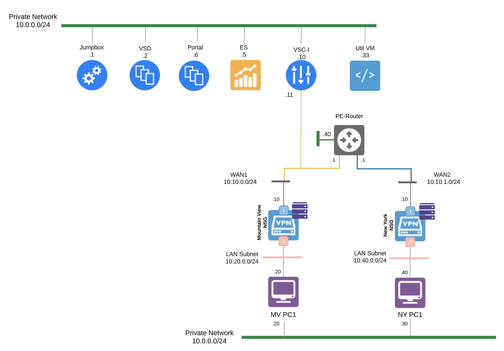

# 0830-VNS-MONITORING-GENERIC

* **version:** 1.0.0
* **tags:** Monitoring
* **requirements**: Nuage 5.3.3+
* **designer**: Arun Poonia

This lab deploys a generic VNS lab with NSG-Vs. The lab consists of an Organization comprised of a Mountain View and a New York Branch sites deployed over a single underlay (Internet).

Both Mountain View and New York branches are equipped with an NSG. Each NSG has one PC present on LAN subnet.

The automation harness provided with this lab enables a user to demonstrate the following use case:

* Bootstrapping NSG-Vs
* SD-WAN Portal

Once automatically deployed and configured the lab will conform to the following diagram:


The Mountain View site and New York branch offices are equipped with the [Branch-PC image](https://nuagenetworks.zendesk.com/hc/en-us/articles/360010244033) which allows to generate and analyze traffic as well as run some real-world applications.

# Deployment
The deployment process is powered by [nuxctl](https://nuxctl.nuagex.io) CLI tool. The infrastructure deployment activities will be triggered once a user supply the lab template available in this repo to the `nuxctl` tool.

The lab template is based on the **Nuage Networks 5.3.3U3** NuageX template and has additional infra components defined to support the integration and use cases demonstration.

```bash
# make sure to fill in your nuagex public key information in the lab template
# before running the command
nuxctl create-lab -c my_creds.yml -l  nuxctl_0830-vns-monitoring_generic.yml --wait
```

You should update your `nuagex` username and password in `my_creds.yml` file.

# Configuration
When the lab deployment is finished, proceed with automatic lab configuration. Lab configuration automation is saved in a set of [CATS](http://cats-docs.nuageteam.net) scripts contained in a [cats](./cats/) folder of this repo.

As of v1.0.0 of this automation suite CATS should be launched from a machine located **outside** of a NuageX lab.

## Variables file
The lab configuration can be parameterized by changing the variables in the [vars.robot](./cats/vars.robot) file. Some variables values in this file are marked with `TO_BE_FILLED_BY_A_USER` string and therefore must be provided by a user before running the configuration scripts.

### SSH keys
To enable CATS to connect to the Labs components a path to the users private key should be specified on line [48](./cats/vars.robot#L48) of the variables file. This is the private key of the public key that a user should have configured in theirs NuageX user profile.

When a user executes CATS scripts using the local CATS installation, then this path should point to an existing file on a users machine.

On the other hand, when [CATS container](http://cats-docs.nuageteam.net/user_guide/cats_docker_container/) is used, the path specified on that line should conform to the path that exists in a container. Consider the following example where the local default ssh path directory is exposed to the CATS container by means of the volumes:

```
docker run -t \
  -v ${HOME}/.ssh:/root/.ssh \
  -v `pwd`/cats:/home/tests \
  cats -X -e solo_run /home/tests
```

Example: ```docker run -t -v ~/.ssh:/root/.ssh -v `pwd`/cats:/home/tests cats -X  /home/tests```

Here, the hosts `${HOME}/.ssh` folder contents is exposed to the CATS container and mounted there as `/root/.ssh` directory. This means, that the `id_rsa` key on the local host will be available to the CATS container by the `/root/.ssh/id_rsa` path, and this path should be configured on line [82](./cats/vars.robot#L82) of the variables file.

## Starting configuration process
The configuration process will handle all the heavy-lifting of the lab configuration. Starting with overlay objects creation, going through NSG bootstrap and activation, finishing with VNFs creation and deployment.

To launch the configuration sequence a user needs to download CATS to their machine or use CATS in a container.

The following example start the whole configuration process using CATS docker container on a users machine:

```bash
# being in the lab directory (where this README.md file is located)
# flags:
## -X -- stop the execution if error occurs
## -e solo_run -- exclude the test cases marked with `solo_run` tag

docker run -t \
  -v ${HOME}/.ssh:/root/.ssh \
  -v `pwd`/cats:/home/tests \
  cats -X -e solo_run /home/tests
```

The configuration ends in a success if every step is marked with the PASS status. The configuration execution log can be found under `cats/reports` directory.

> Note, lab configuration does not create agents in the ObserverLive service, this needs to be carried out manually before running the CATS scripts.

# Use cases

Provide a generic VNS monitoring platform to allow two NSG-Vs and PC behind each NSG.